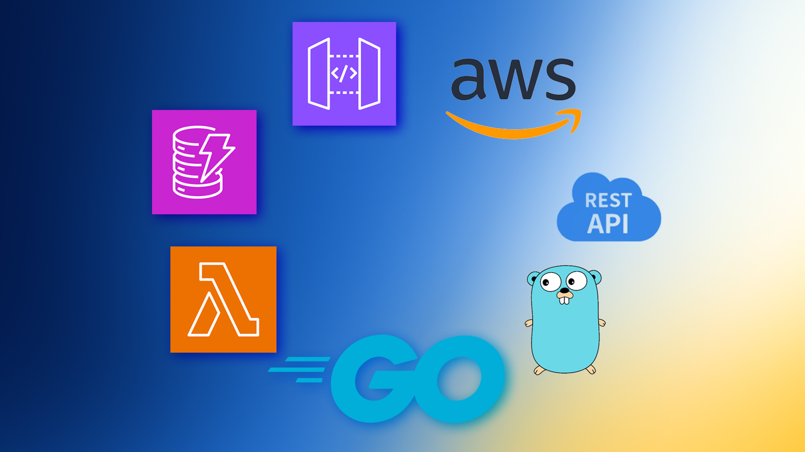
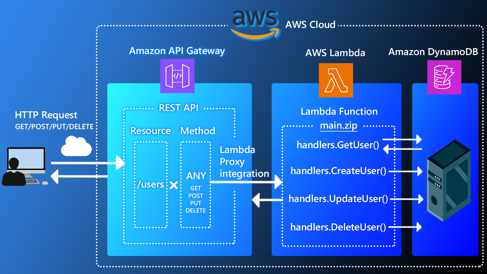
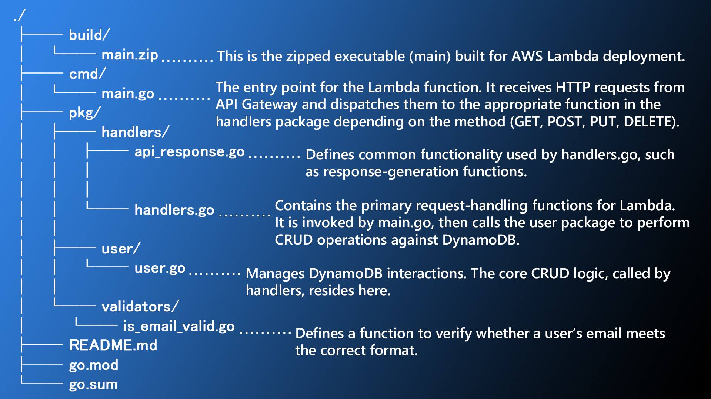

# Serverless Architecture with Go and AWS
<p align="center">
    
</p>

Created a user information management API using Go, API Gateway, Lambda, and DynamoDB. It allows retrieving, registering, updating, and deleting data such as email address, first name, and last name.

## Main Features
<p align="center"> 
  
</p>

### GET
Fetches user information from DynamoDB. If you specify an email address, only that user’s data is retrieved; if not, it fetches all user records.

To get data for a specific user (`usa.name.b@gmail.com`):
```bash
$ curl -X GET https://xvqm1n9op1.execute-api.ap-northeast-1.amazonaws.com/staging-v100\?email\=usa.name.b@gmail.com
```
To get all user data:
```bash
$ curl -X GET https://xvqm1n9op1.execute-api.ap-northeast-1.amazonaws.com/staging-v100
```

### POST
Registers new user information in DynamoDB.

For example, to register `email: usa.name.a@gmail.com, firstName: Liam, lastName: Johnson`:
```bash
$ curl --header "Content-Type: application/json" --request POST --data '{"email": "usa.name.a@gmail.com", "firstName": "Liam", "lastName": "Johnson"}' https://xvqm1n9op1.execute-api.ap-northeast-1.amazonaws.com/staging-v100
```
### PUT
Updates existing user information in DynamoDB.

For example, to update the user with `email: usa.name.b@gmail.com` to `firstName: Noah, lastName: Smith`:
```bash
$ curl --header "Content-Type: application/json" --request PUT --data '{"email": "usa.name.b@gmail.com", "firstName": "Noah", "lastName": "Smith"}' https://xvqm1n9op1.execute-api.ap-northeast-1.amazonaws.com/staging-v100
```
### DELETE
Deletes user information in DynamoDB.

For example, to delete the user with `email: usa.name.a@gmail.com`:
```bash
$ curl -X DELETE https://xvqm1n9op1.execute-api.ap-northeast-1.amazonaws.com/staging-v100\?email\=usa.name.a@gmail.com
```

## Overview of System Configuration

A client PC sends HTTP requests (GET / POST / PUT / DELETE) to an API Gateway endpoint via `curl` commands. When an HTTP request arrives, the Lambda function is triggered and performs CRUD operations (create, read, update, delete) on DynamoDB.

### Amazon API Gateway
Manages the REST API, serving as the entry point for client HTTP requests. We define “one resource” and attach a single `ANY` method to it, then pass requests directly to the Lambda function via Lambda proxy integration (no mapping templates).

### AWS Lambda
Contains a Lambda function (written in Go) associated with the `ANY` method in API Gateway. When an HTTP request from API Gateway arrives, this function is invoked, determines whether the request is GET/POST/PUT/DELETE, and performs the corresponding data operations against DynamoDB.

### Amazon DynamoDB
A NoSQL database that stores the user information handled by the Lambda function. Concretely, it uses “email” as the partition key, and each record holds an email, first name, and last name.

## Directory Structure


## Technologies Used
#### Language
- Go (1.23.3)

#### Infrastructure
- Amazon API Gateway
- AWS Lambda
- Amazon DynamoDB

#### Packages
- aws-lambda-go (v1.47.0)
- aws-sdk-go (v1.55.5)

## License
This project is licensed under the MIT License. See [LICENSE](LICENSE).

## Donations

If you would like to support the development of future projects or help pay my next month's rent, you can donate ETH to `0x84fE8C7704a24a0604863718522c8426885105Af`.